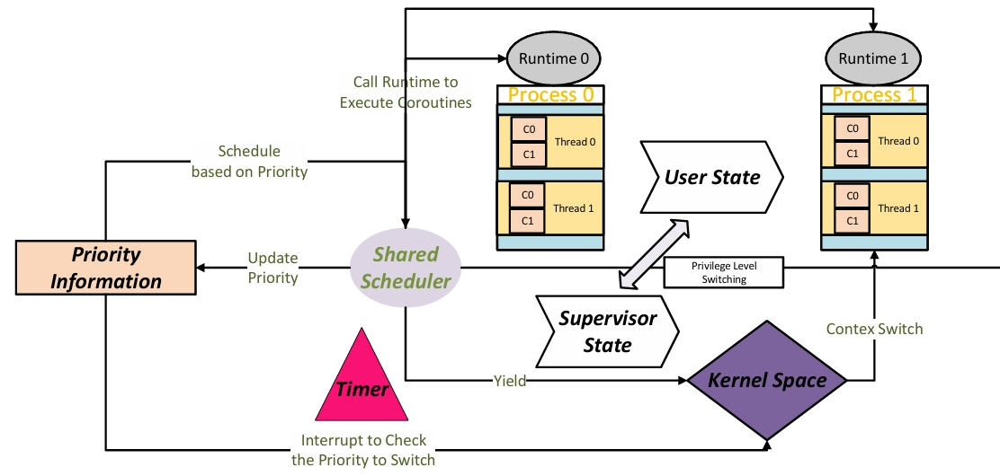
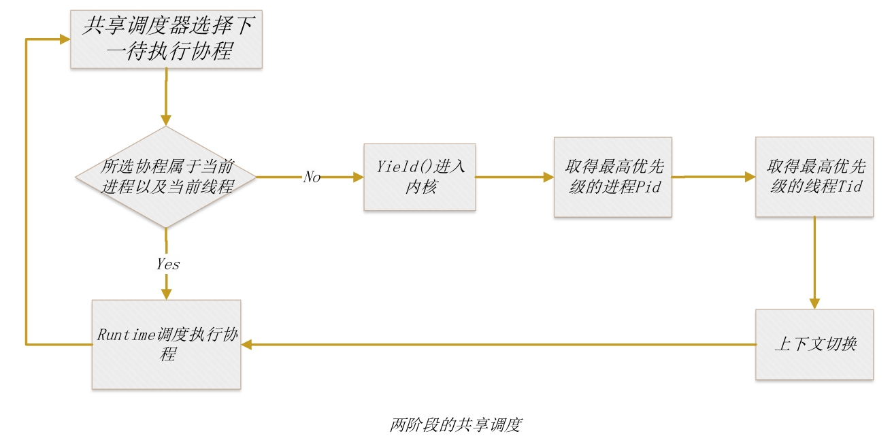
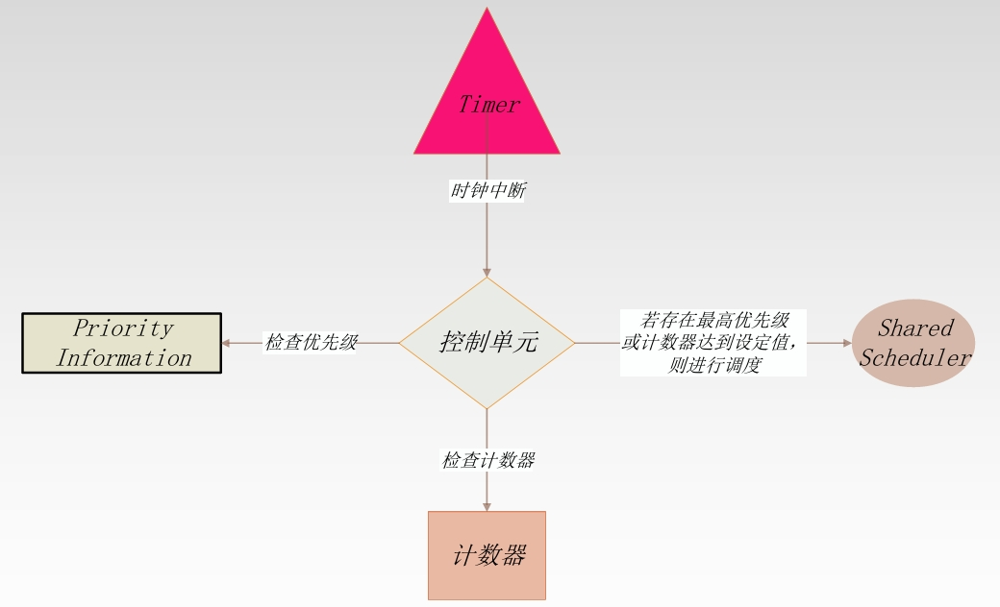

<style>
   p { font:14pt kai !improtant}
   /* img{
    display:block;
    margin-left:auto;
    margin-left:auto;
   } */
</style>

<!--目录-->
[TOC]

# proj146技术文档

* 赛题：支持优先级的rust协程调度
* 学校：武汉大学 WHU
* 队名：rust协程不排队
* 成员：葛洋、张珈豪、李晋
* 指导教师：龚奕利、胡创

## 赛题描述与完成情况
### 目标描述
&ensp; 在rCore和zCore等用Rust写的操作系统中可以使用Rust语言的异步编程机制来实现基于状态机的协程，从而提高内核和应用程序内的并发执行性能。本项目希望在协程实现中引入优先级，并支持基于协程优先级的进程、线程和协程统一调度。

### 完成情况
|预期目标|目标介绍|初赛完成情况|决赛完成情况|
|:-------:|:--------:|:-------:|:------:|
目标一|用户态进程内支持基于优先级的线程和协程统一调度|初步在操作系统中加入协程，并实现协程的执行调度|优化协程结构，支持协程阻塞|
目标二|内核态支持基于优先级的进程、线程和协程统一调度|实现共享调度器，支持进程、线程以及协程的统一调度，后续需要对调度算法进行进一步优化以提高性能 |进一步优化调度算法提高性能|
目标三|利用时钟中断在进程间共享操作系统内核的就绪协程的最高优先级信息，并支持偏好最高优先级协程的处理机器调度|支持协程抢占，后续需要更好地设置通信机制以及设置不同的时钟中断|完善时钟中断抢占机制，设置计数器支持在调度轮转时间片内多次检查协程优先级|
目标四|测试调度器的并发性和实时性|已初步完成在模拟器环境下的测试|进一步在qemu模拟器完善测试检验调度器的并发性与实时性|


## 项目进展
### 第一阶段（三月）[对应进展](#项目背景)
1. 调研现有rust操作系统以及关于协程的优先级调度， 分析各自功能与不足；
2. 搭建开发环境，确定开发路线。
### 第二阶段 （四月）[对应进展](#协程结构及runtime设置)
1. 搭建基础rCore_c框架，将带优先级的协程加入用户态以实现用户态的简单调度；
2. 在qemu环境上进行简单测试。
### 第三阶段 （五月）[对应进展](#共享调度器设计)
1. 设置共享内存存储优先级信息，让用户态与内核态均能访问优先级信息；
2. 搭建共享调度器，实现以协程为操作系统最小可见单元的进程、线程、协程三者统一调度；
3. 在qemu虚拟环境上进行简单的测试。
### 第四阶段 （五月）[对应进展](#基于时钟中断的抢占式调度)
1. 在共享调度器中加入时钟中断，利用时钟中断在进程间共享就绪协程的最高优先级信息，并支持偏好最高优先级协程的处理机器调度；
2. 在qumu虚拟环境上进行测试。
### 第五阶段 （六月&七月）
1. 解决前面阶段尚未解决的问题并进行整体复盘总结。
2. 完善并改进共享调度器的设计实现并完善项目文档；
3. 对所实现内核进行并发性与实时性的测试；


### 代码文件目录结构：
```
rcore_c-main
├─ .dockerignore
├─ .gitignore
├─ bootloader
│  └─ rustsbi-qemu.bin
├─ dev-env-info.md
├─ Dockerfile
├─ easy-fs
│  ├─ .gitignore
│  ├─ Cargo.toml
│  └─ src
│     ├─ bitmap.rs
│     ├─ block_cache.rs
│     ├─ block_dev.rs
│     ├─ efs.rs
│     ├─ layout.rs
│     ├─ lib.rs
│     └─ vfs.rs
├─ easy-fs-fuse
│  ├─ Cargo.toml
│  └─ src
│     └─ main.rs
├─ figures
│  └─ logo.png
├─ LICENSE
├─ Makefile
├─ os
│  ├─ build.rs
│  ├─ Cargo.toml
│  ├─ Makefile
│  └─ src
│     ├─ assert
│     │  ├─ desktop.bmp
│     │  ├─ file.bmp
│     │  ├─ folder.bmp
│     │  └─ mouse.bmp
│     ├─ boards
│     │  └─ qemu.rs
│     ├─ config.rs
│     ├─ console.rs
│     ├─ drivers
│     │  ├─ block
│     │  │  ├─ mod.rs
│     │  │  └─ virtio_blk.rs
│     │  ├─ bus
│     │  │  ├─ mod.rs
│     │  │  └─ virtio.rs
│     │  ├─ chardev
│     │  │  ├─ mod.rs
│     │  │  └─ ns16550a.rs
│     │  ├─ gpu
│     │  │  └─ mod.rs
│     │  ├─ input
│     │  │  └─ mod.rs
│     │  ├─ mod.rs
│     │  ├─ net
│     │  │  └─ mod.rs
│     │  └─ plic.rs
│     ├─ entry.asm
│     ├─ fs
│     │  ├─ inode.rs
│     │  ├─ mod.rs
│     │  ├─ pipe.rs
│     │  └─ stdio.rs
│     ├─ lang_items.rs
│     ├─ linker-qemu.ld
│     ├─ main.rs
│     ├─ mm
│     │  ├─ address.rs
│     │  ├─ frame_allocator.rs
│     │  ├─ heap_allocator.rs
│     │  ├─ memory_set.rs
│     │  ├─ mod.rs
│     │  └─ page_table.rs
│     ├─ net
│     │  ├─ mod.rs
│     │  ├─ port_table.rs
│     │  ├─ socket.rs
│     │  ├─ tcp.rs
│     │  └─ udp.rs
│     ├─ sbi.rs
│     ├─ sync
│     │  ├─ condvar.rs
│     │  ├─ mod.rs
│     │  ├─ mutex.rs
│     │  ├─ semaphore.rs
│     │  └─ up.rs
│     ├─ syscall
│     │  ├─ coroutine.rs
│     │  ├─ fs.rs
│     │  ├─ gui.rs
│     │  ├─ input.rs
│     │  ├─ mod.rs
│     │  ├─ net.rs
│     │  ├─ process.rs
│     │  ├─ sync.rs
│     │  └─ thread.rs
│     ├─ task
│     │  ├─ context.rs
│     │  ├─ id.rs
│     │  ├─ manager.rs
│     │  ├─ mod.rs
│     │  ├─ process.rs
│     │  ├─ processor.rs
│     │  ├─ signal.rs
│     │  ├─ switch.rs
│     │  ├─ switch.S
│     │  └─ task.rs
│     ├─ timer.rs
│     └─ trap
│        ├─ context.rs
│        ├─ mod.rs
│        └─ trap.S
├─ ping.py
├─ readme.md
├─ rust-toolchain.toml
├─ setenv.sh
├─ shared               //this is main of our work
│  ├─ Cargo.toml
│  ├─ makefile
│  └─ src
│     ├─ config.rs
│     ├─ console.rs
│     ├─ lib.rs
│     ├─ linker.ld
│     ├─ sharedscheduler
│     │  ├─ bitmap.rs
│     │  ├─ coroutine.rs
│     │  ├─ mod.rs
│     │  ├─ runtime.rs
│     │  └─ sharedscheduler.rs
│     └─ syscall.rs
└─ user
   ├─ .gitignore
   ├─ Cargo.toml
   ├─ Makefile
   └─ src
      ├─ bin
      ├─ console.rs
      ├─ file.rs
      ├─ io.rs
      ├─ lang_items.rs
      ├─ lib.rs
      ├─ linker.ld
      ├─ net.rs
      ├─ sync.rs
      ├─ syscall.rs
      └─ task.rs

```


## 项目背景
### 进程、线程与协程
&ensp; 进程、线程和协程是操作系统内部用于并发执行任务的三种主要概念。
#### 进程（Process）
* 定义：进程是一个独立运行的程序实例，拥有自己完整的资源和内存空间。
* 特性：
    * 进程之间是独立的，互不干扰; 
    * 进程有自己的内存地址空间，变量和数据不共享; 
    * 操作系统为每个进程分配资源，如内存、文件句柄等。
* 开销：由于进程是完全独立的，进程间的切换（上下文切换）开销较大，需要保存和恢复大量的状态信息。
* 通信：进程间通信（IPC）机制较为复杂，如管道、信号、共享内存等

#### 线程 (Thread)
* 定义：线程是进程内部的一个执行单元，多个线程共享同一进程的资源和内存空间。
* 特性：
    * 线程之间可以共享内存和变量，通信较为容易;
    * 线程的创建和销毁比进程要轻量，切换开销较小;
    * 多个线程可以并发执行，提高程序的响应速度;
* 开销：线程的上下文切换开销较小，但仍需要操作系统调度。
*安全性：由于线程共享同一内存空间，容易发生数据竞争和死锁，需要同步机制（如互斥锁）来保证线程安全。

#### 协程 （Coroutines）
* 定义：协程是一种比线程更轻量级的并发执行方式，允许在单一线程内进行多任务协作。
* 特性：
    * 协程由程序员显式调度，通常在一个线程内运行，不依赖操作系统调度；
    * 切换开销极小，不需要操作系统上下文切换；
    * 协程可以暂停和恢复执行，适用于IO密集型任务；
    * 更容易实现非阻塞I/O操作，提高程序性能；
* 开销：由于不需要操作系统参与调度，协程的切换几乎没有开销。
* 通信：协程之间可以直接通过共享内存通信，无需复杂的同步机制。

#### 比较
|特性|进程|线程|协程|
|:--:|:--:|:--:|:--:|
|创建开销|高|中|低|
|上下文切换|慢|较快|快|
|内存空间|独立|共享|共享|
|通信|复杂|较容易|容易|
|调度方式|操作系统|操作系统|用户空间|
|使用场景|独立运行程序|并发任务|高并发IO操作|

&ensp; 协程由于其高效性、简单性、资源占用率低，天然适合处理非阻塞I/O操作，在处理大量并发I/O密集型任务时具有明显的优势。

### rust支持的操作系统
&ensp; Rust 语言是一种高效、可靠的通用高级语言。其高效不仅限于开发效率，它的执行效率也是令人称赞的，是一种少有的兼顾开发效率和执行效率的语言。
rust语言的特点：
* 高性能：Rust 速度惊人且内存利用率极高。由于没有运行时和垃圾回收，它能够胜任对性能要求特别高的服务，可以在嵌入式设备上运行，还能轻松和其他语言集成。
* 可靠性：Rust 丰富的类型系统和所有权模型保证了内存安全和线程安全，让您在编译期就能够消除各种各样的错误。

* 生产力：Rust 拥有出色的文档、友好的编译器和清晰的错误提示信息， 还集成了一流的工具 —— 包管理器和构建工具， 智能地自动补全和类型检验的多编辑器支持， 以及自动格式化代码等等。

&ensp; 同时，rust封装future用于表示一个可能尚未完成的值或计算，以便用于异步编程，future具有高效性、组合性、错误处理以及并发性等优势，提供了一种高效的方式处理异步编程任务，开发者可以编写高性能的非阻塞代码，并轻松地管理异步任务的调度和执行。

&ensp; Rust语言具有与C一样的硬件控制能力，且大大强化了安全编程。从某种角度上看，新出现的Rust语言的核心目标是解决C的短板，取代C。所以用Rust写OS具有很好的开发和运行的体验。

&ensp; rCore作为用Rust语言编写的基于RISC-V架构的类Unix内核，目前具有基本的内存管理、进程管理、文件系统功能，不仅支持模拟器环境（如QEMU），还支持在真实硬件平台（如Kendryte K210）上运行。
&ensp; 尽管rCore在后续发展出了多个版本，但原有的rCore操作系统的设置较为简单，支持进程与线程但却并未引入协程的概念，与此同时，rCore中的调度策略采用基于时间片轮转的先进先出，虽然能够支持操作系统正常完成任务，但并发性仍有待提升。


&ensp; 尽管rCore的部分改进版本已经加入了协程概念，但这些版本的操作系统将协程与线程同一作为task，不再区分开来，并未真正意义上实现进程、线程、协程三者的统一调度，与此同时，在操作系统中支持时钟中断进行抢占也是这些版本操作系统所欠缺的功能。

&ensp; 因此我们在原有rCore的框架下，改进并提出支持优先级协程调度的rust操作系统rCore-c，完成了下述工作与改进：
1. 将协程加入rCore，以协程为最小的任务单元进行调度运行；
2. 将优先级加入协程，实现共享调度器基于优先级完成用户态与内核态中进程、线程与协程的统一调度；
3. 设置定时器利用时钟中断，获取就绪协程的最高优先级信息以支持基于优先级的抢占式调度；
4. 在模拟器环境完成共享调度与抢占式调度的测试，一定程度上证明了所提出的rCore-c能够进一步提高内核和应用程序内的并发执行能力。


## 系统框架设计
&ensp; 为在rCore中实现具有优先级的协程，并支持基于协程优先级的进程、线程和协程统一调度，我们将整个任务进行分析拆解并得到以下子任务：
1. 依据rCore现有项目及文档，设计支持优先级的协程结构以及理清协程、线程及进程三者之间的关系；
2. 设计合理的内存分配方案，开辟用户态以及内核态可共享的内存空间以存取优先级信息以及协程状态，以便支持共享调度。
3. 设计共享调度器，在原有基于时间片轮转的调度机制的基础上，实现进程、线程、协程三者的共享调度；
4. 设置定时器通过时钟中断定时查询共享内存中的优先级信息并实现协程抢占；
5. 设计测试用例检验所实现rCore-c操作系统的实时性与并发性。

*项目流程图*

&ensp; rCore-c的整体架构如下[系统框架图](#系统框架图)所示。
&ensp; 首先我们设计了协程结构。操作系统内存在多个进程，每个进程内存在多个线程，而同一线程内存在多个协程。同时，每个进程都拥有一个各自的Runtime负责该进程内不同线程内协程的创建运行等操作。

&ensp; 为实现基于优先级的协程共享调度，我们需要在内存空间开辟一片区域作为共享内存存储线程以及所属进程对应的协程优先级信息。优先级信息能够通过共享调度器进行修改更新，同时，内核态与用户态均需能够读取共享的优先级信息以便共享调度器进行任务调度。

&ensp; 关于任务调度，共享调度器（SharedScheduler）执行线程与进程的调度，这涉及到调度过程中特权级的切换，因此为共享调度器设置Yield()系统调用以便不同进程与线程进行上下文的切换。在用户态，同一进程中同一线程的协程执行由每个进程所拥有的执行器Runtime负责进行。由于执行器由进程所拥有，因此能够共享当前进程内线程的部分信息，并自行调度给定线程内的协程执行。

&ensp; 为实现基于优先级的协程抢占式调度，我们需要为内核设置一个定时器（Timer），定时器将定时访问共享内存中的优先级信息，若出现了一个更高优先级的协程任务，将会交由共享调度器进行调度以将CPU让出给更高优先级的任务。同时，为了更好地提高调度性能，我们为相同优先级的协程采取时间片轮转的先进先出调度，防止某个高优先级协程持续抢占CPU资源而使其余相同优先级协程一直等待。


*系统框架图*

### 协程结构及Runtime设置
#### 协程结构与优先级
&ensp; 有栈协程的上下文切换开销不可忽视。因为可以被随时打断，所以我们有必要保存当时的寄存器上下文，否则恢复回去时就不能还原现场。无栈协程没有这个问题，这种模式非常符合 Rust 的 Zero Cost Abstraction 的理念。

&ensp; 为实现无栈协程，我们考虑采用Rust中的异步Future对任务进行封装，协程的主要数据结构如下所示：
* cid：每个协程将会分得一个usize标识作为自己的id，为方便起见，我们为每一个进程设置一个cid分配器，这也意味着同一进程不同线程内的协程不能拥有相同的cid；
* prio：在创建协程的时候需要主动为每个协程设置一个优先级，这个优先级将会影响后续进程以及线程的调度，若创建协程时未设置优先级，将默认为协程设置最低优先级；
* future：用于封装异步任务；
* waker：用于通知执行器，唤醒被挂起的Future。

&ensp; 因此，每一个协程能够被封装成一个Coroutine结构并等待所属进程Runtime对其poll执行。

&ensp; 关于优先级的设置，我们设置协程优先级为1-8，其中数字越小说明协程的优先级更高，8为最低优先级。当创建协程未给出优先级信息，则自动将初始的协程优先级设置为最低优先级8。

*优先级设置*
#### Runtime设置
&ensp; 协程的执行需要一个运行时（Runtime），在rust中，异步函数和Future的执行都依赖于Runtime来调度和管理，Runtime负责执行任务并处理任务之间的切换，

&ensp; Tokio作为Rust编程语言的一个异步运行时，具有速度快、安全可靠、简单灵活等优势，被广泛应用于支持高性能网络应用程序开发当中。参考Tokio中Runtime的设置，我们为创建的每个进程设置一个Runtime以支持线程内协程的管理调度。考虑到同一进程内的线程能够共享部分进程信息，因此我们并不单独为进程内的每个线程设置一个runtime，而是将Runtime用于同一进程内所有线程的协程调度，这样可以一定程度上减少资源的使用。

&ensp; 为正确且高效地管理调度协程，我们精心设计了Runtime 的数据结构，用于存储该进程调度过程中所需的优先级相关信息，具体设置如下所示：
|数据结构|类型|说明|
|:--:|:--:|:--:|
|currents_cid|[Option<CidHandle>; MAX_THREAD_NUM]|当前各个线程的最高优先级协程Id|
|thread_prio|[usize; MAX_THREAD_NUM]|当前各个线程内协程的最高优先级|
|tasks|BTreeMap<CidHandle, Arc<Coroutine>>|协程map|
|ready_queue|[BTreeSet<CidHandle>; MAX_THREAD_NUM * PRIO_NUM]|不同优先级协程的就绪集合|
|pending_set|[BTreeSet<usize>; MAX_THREAD_NUM]|阻塞协程集合|
|bitmap|BitMap|进程的协程优先级位图|
|threadmap|[BitMap; MAX_THREAD_NUM]|各个线程的协程优先级位图|
|max_prio|usize|当前进程内协程的最高优先级|
|wr_lock|RunMutex|整个 Runtime 的读写锁|

&ensp; 基于上述所提供数据，Runtime提供主要接口包括创建、删除、阻塞协程以及更新协程状态等，说明如下所示：
|函数|返回值|说明|
|:--:|:--:|:--:|
|spawn(future,prio, pid, tid,kind) |cid|创建协程并返回协程cid|
|del_coroutine( tid,cid)|None|删除协程并更新优先级|
|fetch_coroutine(tid)|Coroutine|获取当前线程最高优先级的协程|
|pending_coroutine(tid, cid)|None|将协程加入pending队列|
|pull_to_ready(tid, cid)|usize|将协程重新加入ready队列并更新优先级|

&ensp; 为实现对于协程高效且有效的管理，要求同一进程内的所有线程均能够访问该进程的Runtime，因此我们将Runtime声明为.data section的一个子段.data.executor，在内核的链接过程中，链接器将其放入物理内存中内核代码的.data数据段当中，以便管理不同线程内的协程调度。在用户进程的链接过程中，同样将其放入对应的.data数据段中，使得每一个进程都有其独立的执行器。

&ensp; 由于进程的代码和数据段的大小各不相同，因此无法统一确定链接器文件中返回的executor起始地址，因此这里采用间接寻址方法：在每一个地址空间中(包括内核和用户进程)额外设置一个heap_buffer页，位于kernel base_address的正下方。在这个heap_buffer页中，存放当前进程的.data.executor的起始地址。

&ensp; 当需要调用Runtime的执行器时，通过访问地址固定的heap_buffer取出其中存放的地址不固定的executor的地址来调用执行器的函数。

&ensp; Runtime地址空间分配如下所示：


*Runtime地址空间分配*

### 共享调度器设计
&ensp; 在前面我们提到需要为每个进程设置一个运行时Runtime，这个Runtime将管理用户态同一线程内的协程执行。然而，当需要进行进程以及西线程的调度时，会进入内核进行上下文的切换，这个时候仅仅依靠用户态的Runtime是无法完成的。因此，我们需要设置共享调度器用于不同进程以及不同线程之间的切换。SharedScheduler与Runtime共同完成了进程、线程、协程这三个不同粒度任务之间的统一调度。

&ensp; 进程、线程、协程三者的调度是本项目的基石所在，SharedShceduler将根据内核态与用户态共享的优先级信息进行全局调度，若不需要进行进程或者线程的切换，那么共享调度器将任务继续交给执行器Runtime执行；若出现了一个拥有更高优先级协程的进程或者线程，当前执行器将无权处理更高优先级协程，SharedScheduler将主动进行Yield进入内核进行上下文切换至最高优先级协程所属进程的线程当中以执行最高优先级的协程。

#### 优先级共享内存管理
&ensp; 在共享调度器的设计当中，优先级信息是任务调度的依据。
为方便调度，我们设计了全局SharedProcessPrioArray用于存储各个进程中协程的最高优先级，优先级数值越小代表该进程内的某个协程具有更高的优先级，SharedProcessPrioArray可以用来指示进程的调度选择。

&ensp; 与此同时，我们设计了全局的SharedThreadPrioArray用于存储各个进程内各个线程的协程最高优先级，以便选取合适的线程。

&ensp; 由于优先级信息需要在用户态与内核态两个不同的特权级之间进行共享，因此，我们需要合理地分配内存用于存储优先级信息。

&ensp; 不同于Runtime的共享方式，优先级信息表只需要在kernel的.data段实例化一次即可。其在物理内存中的地址是确定的，因此我们可以通过将其映射到统一的虚拟地址以实现共享内存。

&ensp; 在内核地址空间的创建阶段，将进程优先级表、线程优先级表从由链接器文件返回的物理内存地址映射到内核的虚拟空间(虚拟地址由自己选定，这里我们选用上文提到的heap_buffer下面的两页，每张表各映射到一个PAGESIZE大小的空间)。

&ensp; 进程地址空间的映射类似，在创建进程的页表时(不论是通过elf文件加载还是fork等复制)，同样将其映射到进程的虚拟空间的某一个位置。为了简化后续的访问，同时考量用户进程实际所能使用的空间限度，我们将位于同一物理内存的两张表映射到与内核地址空间相同的位置，即heap_buffer的下方。


*优先级信息地址空间分配*

#### 进程、线程、协程统一调度
&ensp; 在加入具有优先级的协程之后，我们设计了调度策略并将其总结为一个两阶段的进程/线程调度策略。

&ensp; 每次调度过程，共享调度器将尝试poll最高优先级的协程，若最高优先级协程在当前进程以及当前线程之中，将直接调用该进程的Runtime进行执行协程；若最高优先级协程在不同进程或者不同线程当中，共享调度器将使用yield()系统调用进入内核态，并首先根据SharedProcessPrioArray取出优先级最高的进程Pid，接着根据所获得的Pid以及SharedThreadPrioArray取出优先级最高的线程Tid并进行上下文切换，接着同样将任务直接交由所切换后的进程的Runtime负责执行管理。

&ensp; 在上述两阶段调度过程，首先第一阶段交由共享调度器进行所需的进程/线程调度并完成上下文切换；第二阶段将任务交由最高优先级协程所在的进程的Runtime负责执行管理。

&ensp; 调度流程如下所示：



*进程、线程、协程统一调度*

&ensp; 在进行任务的选择调度过程当中，我们的调度策略将同时考虑优先级与先进先出。调度器每次都会尝试取出优先级最高的进程与线程，当存在多个相同且最高优先级的协程时，将采用先进先出的时间片轮转策略以避免单个协程一直占用CPU。为实现时间片轮转的先进先出，我们对所存储的共享数据进行扩展，将当前运行协程所对应的进程Pid(Pid_cur)以及所属线程Tid(Tid_cur)存入其中，则下一次协程将会从不同于当前Pid于Tid的进程与线程中选取并进行调度。

&ensp; 选择优先级最大的进程与线程的伪码分别如Pseudocode 1与Pseudocode 2所示。

```pseudocode
Pseudocode 1
输入：进程优先级信息SharedProcessPrioArray，当前进程Pid_cur
输出：下一最高优先级协程所属进程Pid_next
max_prio_pid():
    if 当前进程存在多个最高优先级的协程：     //若同一进程存在多个最高优先级协程，则先调度同一进程内协程
        return Pid_cur
    Pid_next = (Pid_cur + 1) % MAX_PROC_NUM //获取下一进程pid，最大进程数为MAX_PROC_NUM
    Prio_next = SharedProcessPrioArray[Pid_next]
    for i from 0 to MAX_PROC_NUM:
       pid = (Pid_next + i) % MAX_PROC_NUM //遍历协程优先级，以找到最高优先级进程
       prio = SharedProcessPrioArray[pid]
       if prio<Prio_next:                  //比较优先级，若优先级更高则替换
            Prio_next = prio
            Pid_next = pid
    return Pid_next
```
```pseudocode
Pseudocode 2
输入：线程优先级信息SharedThreadPrioArray，下一进程Pid_next，当前线程Tid_cur
输出：下一最高优先级协程所属进程Tid_next
max_prio_tid():
    Tid_next = (Tid_cur + 1) % MAX_Thread_NUM //获取下一线程tid，最大线程数为MAX_Thread_NUM
    Prio_next = SharedThreadPrioArray[Pid_next][Tid_next]
    for i from 0 to MAX_Thread_NUM:
       tid = (Tid_next + i) % MAX_Thread_NUM //遍历协程优先级，以找到最高优先级线程
       prio = SharedThreadPrioArray[pid]
       if prio<Prio_next:                  //比较优先级，若优先级更高则替换
            Prio_next = prio
            Tid_next = tid
    return Tid_next
```
### 基于时钟中断的抢占式调度
&ensp; 在给协程加入优先级属性之后，我们尝试基于时钟中断为协程进行抢占式调度。基于时钟中断的协程抢占式调度通过周期性中断来检查优先级以保证优先级更高的协程能够得到及时响应，能够提升系统的响应性、公平性和负载均衡能力，是实现高效调度的重要机制。

&ensp; 在原本的rCore中，调度机制较为简单，通过时间片轮转实现了简单的线程抢占调度，为此，rCore中设置了一个时间片，在一个程序用完其时间片后，就抢占当前程序并调用下一个程序执行，周而复始，形成对应用程序在任务级别上的时间片轮转调度，其中涉及到对于时钟中断的处理。

&ensp; 由于软件（特别是操作系统）需要一种计时机制，RISC-V 架构要求处理器要有一个内置时钟，其频率一般低于 CPU 主频。此外，还有一个计数器用来统计处理器自上电以来经过了多少个内置时钟的时钟周期。在 RISC-V 64 架构上，该计数器保存在一个 64 位的 CSR mtime 中，我们无需担心它的溢出问题，在内核运行全程可以认为它是一直递增的。
另外一个 64 位的 CSR mtimecmp 的作用是：一旦计数器 mtime 的值超过了 mtimecmp，就会触发一次时钟中断。这使得我们可以方便的通过设置 mtimecmp 的值来决定下一次时钟中断何时触发。

&ensp; 基于上述已有设置，我们有两种方式提供协程层面基于优先级的抢占式调度：
1. 在时间片轮转的定时器之外重新设置一个定时器，该定时器主频高于处理器内置时钟，当该定时器触发时钟中断时，共享调度器将检查优先级，若存在其余更高优先级协程，则进行上下文切换，保存当前进程的当前线程上下文并切换到更高优先级线程执行协程；
2. 利用原有内置时钟而不另设额外定时器，利用一个计数器代替第二个计时器的功能。设计数器最大值为cnt_max，检查优先级的时间间隔为time_gap，则每个任务的时间片为cnt_max × time_gap。若计数器计数值超过cnt_max，则该任务时间片已用完，自动进行协程调度；否则，每次时间中断将检查优先级，若存在更高高优先级任务，则进行切换，否则继续当前协程的进行。

&ensp; 在实际实现当中，我们选择第二种方式，用一个计数器起到计时的作用，这样首先能够简化实现的难度，并且计数器仅消耗极少的内存资源；另一方面，避免了两个定时器之间时间设置不匹配的问题。


&ensp; 基于时钟中断的抢占式调度过程如[基于时钟中断的抢占式调度](#时钟中断)所示。



*基于时钟中断的抢占式调度*
## 操作系统部署
&ensp; 目前rCore-c已成功部署到Qemu模拟器并能实现基本的调度执行测试。

&ensp; 在实验过程中，我们尝试将rCore-c部署到xilinx artix-a7 XC7A200T-FBG676开发板以及其他不同开发板当中，但由于rCore暂时并未提供在这些开发板上的支持，暂时并未完全进行部署成功。

&ensp; 我们另外尝试在rCore所支持的Kendryte K210开发板上进行测试，已能够初步部署，但具体实验测试有待继续进行。

## 系统测试
&ensp; 系统测试分为三个部分：

&ensp; 一. 基于协程优先级的进程、线程和协程统一调度。

&ensp;二. rCore_c中协程的上下文切换和线程的上下文切换之间的对比实验。

&ensp; 通过确保两者执行流除了上下文切换部分其他一致，运行一定数量的任务，然后get_time系统调用计算务运行时间。测试代码分为以下几种：

1. 在同一个进程的同一个线程中调度协程，但协程的优先级是按照顺序设置，因此会按照优先级调度顺序执行。


2. 在同一个进程的同一个线程中调度协程，但协程的优先级是随机设置的，因此会按照优先级调度乱序执行。


3. 在同一个进程的不同线程中调度协程，但是每个线程依次按照顺序执行完才创建下一个线程，相当于在每个线程内进行协程调度。


4. 在同一个进程的不同线程中调度协程，等到所有线程都创建完协程后，再进行协程的调度执行，但是每一个线程会创建许多相同优先级的协程，且每一个线程的优先级不一致，这样会使得只有一个线程的所有协程做完才会切换到下一个线程中去。


1. 在同一个进程的不同线程中调度协程，等到所有线程都创建完协程后，再进行协程的调度执行，且每一个线程会创建不同优先级的协程，因此会在不同线程之间根据优先级进行切换。


6. 在不同进程之间进行调度,但是子进程的优先级高于父进程,因此会先执行完子进程再执行父进程。


7. 在不同进程之间进行调度,且每个进程中有不同优先级的协程,因此会按照优先级进行调度执行。


8. 在rCore_c中协程的上下文切换和线程的上下文切换两者之间进行对比实验，（确保两者执行流除了上下文切换部分其他一致，运行一定数量的任务，然后计算任务运行时间。）


&ensp;三. 基于时钟中断的抢占式调度及与rCore的性能对比实验

&ensp; 利用时钟中断，首先运行一部分较低优先级的任务，然后插入高优先级的任务对其进行抢占，观察任务的执行顺序。分为以下两种情况：

1. 同一进程中的高优先级协程的抢占。


2. 不同进程中的高优先级协程的抢占。


3. 性能对比。下面数据均采用5次重复实验求平均值，测量值为get_time系统调用返回值。


## 挑战与解决策略
### 关于优先级共享内存的实现
&ensp; 需要在内核和用户态之间共享进程以及协程的优先级信息，以便共享调度器能够综合内核和用户进程之间的调度。经过比较，我们选择共享内存的方式来共享优先级信息。我们将进程及协程的优先级存储在各自的一张全局静态变量表中，并将其声明为kernel的.data section的两个子段，分别为.data.process和.data.thread，在链接阶段，链接器将其与内核的其他内容加载到物理内存相应的位置上(BASE_ADDRESS之上)，声明两个全局变量sprocess和sthread标注这两个表的物理起始地址并返回。

&ensp; 在内核地址空间的创建阶段，将进程优先级表、协程优先级表与trampoline一起从物理内存(因为已知其物理内存起始地址)映射到内核的虚拟空间(虚拟地址由自己选定，这里我们选用BASE_ADDRESS下面的两页，即每张表各映射到一个PAGESIZE大小的空间)。

&ensp; 进程地址空间的映射类似，在创建进程的页表时(不论是通过elf文件加载还是fork等复制)，同样将其映射到进程的虚拟空间的某一个位置。为了简化后续的访问，同时考量用户进程实际所能使用的空间限度，我们将位于同一物理内存的两张表映射到与内核地址空间相同的位置，即BASE_ADDRESS的下方。

&ensp; 需要注意的是，由于地址空间的映射是以页为单位，在链接器的链接阶段，我们需要将两者表的首位部均进行页面大小对齐(即使其可能远小于一个页的大小)，以便后续的映射操作不会将其错误拆分或引入其他干扰内容。
### 关于基于时钟中断实现抢占式调度的实现

&ensp; 前期采用的中断时钟周期与原系统时钟中断周期一致，当时钟中断发生时，调度器挂起当前执行的线程并在就绪队列中找到具有最大优先级的进程，接着寻找对应的线程，然后通过switch切换上下文，使得接下来执行的是当前最大优先级的线程，最后在当前线程中通过fetch_coroutine函数取出对应的协程进行调度，从而实现基于优先级的抢占式调度。

&ensp; 后续进行完善时，我们在原系统时钟中断周期的基础上再进行一个更小粒度的划分，在每个小tick结束时，由调度器检查是否存在更高优先级的任务，若存在，则直接进行调度；否则继续执行当前任务直到下一个时钟中断的到来。

## 比赛收获
&ensp; 在比赛前期阶段，我们小队实现了一个基于RISC-V架构的Rust操作系统，并实现了基于优先级的协程调度与抢占机制。
### 收获
1. 深入理解RISC-V架构：通过实现操作系统，对RISC-V指令集和架构有了深入的理解。这包括RISC-V的寄存器布局、中断处理机制和特权级别等。
2. Rust在系统编程中的应用：Rust作为系统编程语言，其内存安全性和零成本抽象使得编写操作系统变得更加可靠和高效。通过这个项目，我们学会了如何利用Rust的所有权、借用和生命周期等特性来避免常见的内存错误
3. 协程调度与抢占：实现基于优先级的协程调度让我们深入理解了协程的工作原理和调度策略。具体来说，我们了解了如何设计一个高效的调度器，如何实现抢占式调度，以及如何处理协程的上下文切换
4. 优先级调度算法: 设计和实现优先级调度算法，了解了同调度算法的优缺点，并学会了如何根据系统需求选择和优化调度算法
5. 中断和异常处理：实现协程调度和抢占需要处理中断和异常，这让我们对中断处理的细节有了更深的理解。

### 感悟
1. 复杂性管理：操作系统是一个高度复杂的软件系统，涉及多个子系统和模块。通过这个项目，我们了解了如何模块化设计和分而治之，逐步实现和调试各个功能模块。
2. 调试技巧：在低级别编程中，调试是一个巨大的挑战。我学会了使用不同的调试工具和方法，如QEMU仿真器、RISC-V的调试接口，以及Rust特有的调试工具，来排查和解决问题。
3. 安全与可靠性：Rust的安全特性给我们很大的启发。虽然Rust的编译器在编译时就能捕获许多潜在错误，但在操作系统这样的关键软件中，运行时的安全性和可靠性同样重要，因此应该更加重视代码的审查和测试。
4. 性能优化：实现优先级调度和抢占机制后，我们对系统的性能优化有了更深刻的认识。如何减少上下文切换的开销、如何高效地管理协程的状态、如何在保证实时性的同时提升系统吞吐量，都是我在实践中深入思考和探索的问题。

### 总结
&ensp; 实现基于RISC-V架构的Rust操作系统，让我们不仅在技术上有了巨大的提升，也在工程实践、问题解决和团队协作等方面积累了宝贵的经验。这段经历使我们更加坚定了在系统编程领域继续深耕的信心，同时也激发了我们对开源社区和技术分享的热情。

&ensp; 与此同时，我们仍存在急需解决的问题，例如调度策略的优化以及时钟中断更加合理的设置。并且，我们将开始尝试在真实的物理开发板上对rCore-c的功能与性能做出更加合理的测试。


### 参考文献
[1]"rCore-Tutorial-Book-v3 3.6.0-alpha.1文档." [Online]. Available: https://rcore-os.cn/rCore-Tutorial-Book-v3/chapter0/index.html. [Accessed: July 28, 2024].

[2]刘书健.基于协程的高并发的分析与研究[D].昆明理工大学,2016.

[3]李玉奇.基于Linux的实时嵌入式操作系统内核的改进研究[D].沈阳理工大学,2011.


[4]Linux可抢占内核的分析[J]. 徐晓磊,董兆华,吴建峰,陈晓峰,冯金辉.计算机工程,2003(15)

[5]Jin Hong,Wa ng Honga n,Wa ng Qia ng.A real-tim e
scheduling algorithm based on priority table and its
implementation[J].Journal of Software,2004,15(3):360-370.

[6]Yawei Zhou, Junmin Wu, Yi Zhang, Yan Yin, and Shaodi Li. 2020. Design and Implementation of Coroutine Scheduling System on SW26010. In Proceedings of the 5th International Conference on Big Data and Computing (ICBDC '20).

[7]Roman Elizarov, Mikhail Belyaev, Marat Akhin, and Ilmir Usmanov. 2021. Kotlin coroutines: design and implementation. In Proceedings of the 2021 ACM SIGPLAN International Symposium on New Ideas, New Paradigms, and Reflections on Programming and Software (Onward! 2021).

[8]Luis E. Leyva-del-Foyo, Pedro Mejia-Alvarez, and Dionisio de Niz. 2012. Integrated Task and Interrupt Management for Real-Time Systems. ACM Trans. Embed. Comput. Syst.